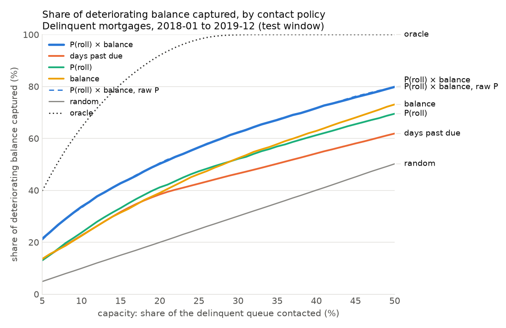
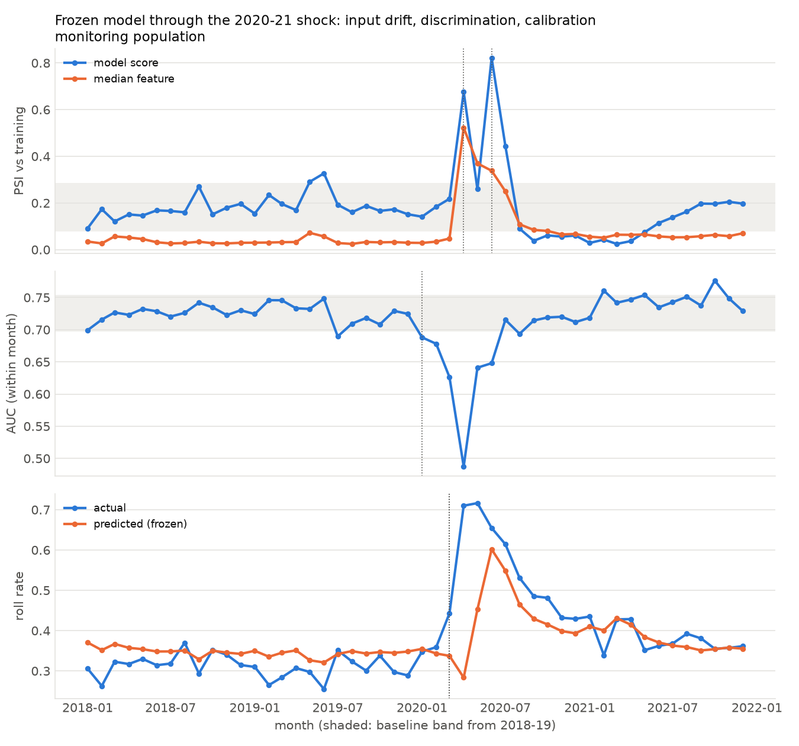

# Collections Prioritisation Engine



Given every mortgage that is already delinquent in a month, and a collections
team that can contact only a fixed share of them, which accounts should be
called first? This project treats that as a **ranking problem under a capacity
constraint**, not as default prediction. Each account is scored as
`P(rolls deeper within 3 months) × balance`: an account that will cure on its
own is worth no call, however large it is, and a likely roller with a small
balance is worth less than a likely roller with a large one. Policies are
compared by how much of the balance that actually went on to deteriorate falls
inside the contact list.

**Headline:** contacting 20% of the delinquent queue ranked by P(roll) ×
balance captured **50.2%** of the balance that rolled deeper over the next three
months, against **38.4%** for ranking by days past due, **39.0%** by balance and
**20.0%** at random (test window 2018–2019, 24 months, 31,061 account-months).

## The project in plain terms

### The situation

A lender has thousands of borrowers who are behind on their mortgage
payments, between one and three months late. Some will catch up on their
own. Others will fall further behind and may end in foreclosure. The
collections team can only phone a fraction of them each month, so every
month someone has to decide who gets called first.

### The problem

The usual rule is to call the people who are furthest behind first. That
rule ignores two things that matter:

- **Not every late account is heading for trouble.** Some borrowers fix
  the problem themselves, and a call to them is wasted effort.
- **Not every account carries the same amount of money.** Missing a
  large loan that is about to go bad costs far more than missing a small
  one.

### What the project does

Every month, for every late account, the project estimates how likely the
borrower is to fall further behind in the next three months. It uses the
loan's details, its recent payment history, and local unemployment and
house-price trends, and only information that would have been available
that month. It multiplies that likelihood by the amount still owed, which
gives a measure of **money at risk**. It then ranks the accounts by that
measure, so the team calls the largest amounts at risk first.

It then replays real history to see how well that ranking would have
worked. It is compared, month by month, with the simple rules a team might
use instead: random order, most days late first, and largest balance first.
A "perfect hindsight" ranking sets the ceiling.

### What it finds out

- **Whether a model-based list beats the rules teams use today, and by how
  much.** With capacity to call 20% of late accounts, the ranked list
  reaches half of all the money that went on to deteriorate. Calling the
  most-overdue accounts first reaches 38%, and calling at random reaches 20%.
- **Whether the advantage holds up every month or depends on a few lucky
  ones.** It beat the days-late rule in all 24 months of the test period.
- **Where the advantage comes from.** Knowing who is likely to deteriorate
  helps only a little on its own. The gain comes from combining that
  likelihood with the amount owed.
- **How much room is left.** Perfect hindsight would reach 92%. The model
  closes about a fifth of the gap between the best simple rule and that
  ceiling, so much of what decides the outcome is not in this data.
- **Whether its probability estimates can be taken at face value.** Not
  exactly: in 2018–19 they ran a few points high. That barely changes who
  gets called (at most 0.4 points of money reached).
- **What happens in a crisis, and which warning signs show up first.** When
  the pandemic hit in 2020, its estimates went wrong in March, and in
  April its ranking was briefly no better than random. Changes in the
  incoming accounts were visible at once, but the error in its estimates
  could only be confirmed three months later. That is why a deployed model
  needs both kinds of monitoring.
- **Whether the results can be trusted.** The test period was set aside
  until the model was finished. The code that builds the call list cannot
  see the outcomes it is graded on. Every rule was fixed before the results
  existed. A clean rebuild reproduces every number exactly.

### What it produces

| Output | What it is | Where |
|---|---|---|
| Account scores | For every late account in each month of the evaluation periods: its estimated likelihood of deteriorating and its balance, which together give its place in the call list | `data/processed/scores/` (loan-level, so not in git) |
| Capture curve | How much of the at-risk money each ranking reaches, for any calling capacity from 5% to 50% | [chart above](outputs/figures/capture_curve_test.png), [table](outputs/tables/policy_curve_test.csv) |
| Results at 10/20/30% capacity | The headline comparison, plus how much of the gap to perfect hindsight is closed | [policy_capture_test.csv](outputs/tables/policy_capture_test.csv) |
| Month-by-month results | Whether the advantage is steady or erratic | [chart](outputs/figures/monthly_capture_test.png), [table](outputs/tables/policy_monthly_test.csv) |
| Model comparison | The model against simpler models on accuracy and reliability | [model_comparison_test.csv](outputs/tables/model_comparison_test.csv), [feature_importance.csv](outputs/tables/feature_importance.csv) |
| Crisis monitor | How the model and its incoming data changed month by month through 2020–21 | [chart](outputs/figures/drift_monitor_monitoring.png), [table](outputs/tables/drift_monitor_monthly_monitoring.csv) |
| Decision log | Every choice made, why it was made, and what went wrong | [docs/methodology.md](docs/methodology.md) |

### How results are measured

| Measure | What it tells you |
|---|---|
| **Capture rate** (the main one) | Of all the money owed by accounts that went on to deteriorate, the share sitting in the accounts the team actually called. Random calling captures roughly the share of accounts called (20% for 20%), which makes it the floor. |
| **Gap closed** | How far the model moves from the best simple rule towards perfect hindsight. 0% is no better than the rule; 100% is perfect. |
| **AUC** | How well the model puts accounts that will deteriorate above those that won't. 0.5 is a coin flip and 1.0 is perfect. Here it is 0.72, against 0.64 for days late alone. |
| **Calibration** (Brier score, calibration error) | Whether a predicted 30% chance really means about 30% of such accounts deteriorate. This matters because the likelihood is multiplied by the balance: if the estimates are off, the list gets reordered. |
| **Population stability (PSI)** | How different this month's accounts look from the ones the model learned from. A sudden jump is an early warning that the model may no longer fit. |

## Results

Out-of-time test window, 2018-01 to 2019-12, scored once by a model frozen
before test was read.

| Share of deteriorating balance captured | C = 10% | C = 20% | C = 30% |
|---|---|---|---|
| Random | 9.9% | 20.0% | 30.1% |
| By days past due (the usual operational rule) | 22.6% | 38.4% | 46.5% |
| By balance | 22.4% | 39.0% | 52.4% |
| By P(roll) alone | 23.7% | 41.1% | 52.1% |
| **By P(roll) × balance** | **33.6%** | **50.2%** | **62.3%** |
| Oracle (perfect hindsight, the ceiling) | 64.3% | 92.0% | 99.9% |

- **The gain comes from combining risk and exposure.** Ranking by probability
  alone barely beats days past due or balance; multiplying the two is what
  moves the number. That is the project's premise, and the data supports it.
- **It is stable month to month:** 49.9% ± 4.2% per month at C = 20%. It beat
  days past due in all 24 months and balance in 23. The exception is the
  first test month, which is an artefact of the split design (see
  [methodology](docs/methodology.md#results-test-window-2018-01-to-2019-12)).
- **The oracle is far ahead.** The model closes about a fifth of the gap
  between the best simple rule and perfect hindsight. Much of what decides
  whether a delinquent mortgage deteriorates is not in this data.
- **Every result passes structural checks** that would expose a broken
  simulation: random lands at the capacity fraction, no policy reaches the
  oracle (a policy that did would mean the outcome leaked into the ranking),
  no policy falls below random, and every curve rises to 100%.

Underneath: a LightGBM model on 58 features (origination attributes, current
state, 3/6/12-month delinquency trajectory, publication-lagged state
unemployment and house prices). Test AUC is 0.724, against 0.639 for days
past due alone and 0.704 for a WOE-binned logistic regression.

## Through a shock (2020–21)



The frozen model was scored, unchanged, on every delinquent account through
the pandemic. Each monitored series is compared with its own 2018–19 range
(shaded):

- **Calibration broke first (March 2020).** 44% of accounts rolled against
  34% predicted, then 71% against 28% in April. March's inputs were still
  normal; its outcomes, three months ahead, were not.
- **Then ranking collapsed (April 2020, AUC 0.49), and inputs moved.**
  Delinquent accounts nearly tripled, and 71% of them were in forbearance
  (1% before), so "rolling deeper" mostly meant missed payments under
  forbearance, not the distress the model learned from.
- **Recovery was uneven.** Ranking was back in its normal range from
  September 2020; the model under-predicted the roll rate for eleven months
  before calibration returned.
- **Monitoring lesson.** Calibration goes wrong first, but it needs outcomes,
  so it is only measurable three months later. Input drift (PSI) is visible
  at once. Both are needed, measured against recent normal months: against
  the 2000–15 training data, 11–15 features exceed the usual 0.25 PSI
  threshold even in calm 2018–19.

Details, including a first run whose result turned out to be an artefact of
the split design, are in the [methodology](docs/methodology.md#stage-6--drift-study).

## Data

[Freddie Mac Single-Family Loan-Level Dataset](https://www.freddiemac.com/research/datasets/sf-loanlevel-dataset),
sample files: 50,000 loans per origination year, 2000–2024, with monthly
performance up to 2026-03 (1.25 million loans, 72 million loan-months).

**The raw data is not in this repository.** Freddie Mac's terms permit
publishing code and analytical results, not redistributing the dataset.
[docs/download.md](docs/download.md) explains how to get it (free
registration, about 15 minutes). `data/` is git-ignored and a pre-commit hook
blocks committing anything under it.

## Limitations

Read these before reusing any number from this project.

- **This is secured US mortgage data.** Collateral changes the loss economics
  completely, and the arrears cycle is far slower than in unsecured lending
  (cards, personal loans, buy-now-pay-later). The method transfers; the
  numbers do not.
- **This measures targeting, not treatment effect.** Nothing in the data
  records who was contacted, and there was no randomised contact assignment.
  The capture rate says how well a policy *finds* the balance that will
  deteriorate. It assumes contact helps, and helps roughly equally across
  accounts. Some accounts likely to roll may not be saveable by a call, and
  some that would cure anyway might cure faster with one. Measuring what
  contact actually changes needs a randomised holdout.
- **Exposure is the unpaid balance, not the loss.** A rolled mortgage is not
  a lost mortgage; recovery through the collateral is large and varies by
  state and house prices. "Balance captured" is a proxy for value at risk,
  not for losses avoided.
- **Calibration did not transfer forward in time.** Every calibration map
  fitted on 2016–17 over-predicted 2018–19 by a similar margin. This was
  recorded as a failed acceptance check rather than fixed with test data.
  It barely changes the ranking (calibrated and raw scores differ by at most
  0.4 points of capture), but the probabilities should not be read as exact
  roll rates.
- **The later splits are a selected population.** To keep every loan in
  exactly one split, validation and test contain only loans whose *first*
  delinquency falls in that window; repeat delinquents are mostly in train.
  The test window is therefore not the whole 2018–19 delinquent book.
- **Macro features use today's revised data.** FRED serves revised series,
  not the values published at the time. Publication lags are applied, but a
  small look-ahead remains in that feature family.
- **The model did not survive the 2020 shock.** Through pandemic forbearance
  its calibration broke and, for a month, its ranking was no better than
  random (see [below](#through-a-shock-2020-21)). The headline result is for
  2018–19, a calm period; it says nothing about performance in a crisis.

## How it was built

Six stages, each with structural acceptance checks that must pass before the
next stage runs. Every decision, including the ones that turned out wrong, is
in [docs/methodology.md](docs/methodology.md).

| Stage | What it does | Main safeguard |
|---|---|---|
| 1. Ingest | Raw files → monthly loan panel (PySpark, local) | Schema generated from the official layout; casts counted, never silently nulled |
| 2. Labels | Delinquent population; did it roll deeper in 3 months? | Calendar-month windows (the source has gaps); splits disjoint by loan |
| 3. Features | 71 candidates → 58 kept, each with a written reason | Every feature declares its time window; a test perturbs later months and asserts no feature moves |
| 4. Models | Baseline, WOE logistic, LightGBM pooled and per-bucket | Test read only after freezing; every test evaluation logged with a timestamp |
| 5. Policy | Ranks the queue each month under six policies | The ranking function raises if it receives the outcome |
| 6. Drift | PSI and monthly AUC/calibration through 2020–21 | Monitoring population checked feature-for-feature against Stage 3 |

Experiments are tracked in MLflow (local SQLite store under `mlruns/`, not
committed). Test was evaluated four times: three during the calibration
investigation and once by the clean-checkout reproduction below. All four
are in [outputs/tables/test_evaluations.csv](outputs/tables/test_evaluations.csv),
and the model's AUC was identical in each.

## Reproducing

Requirements: Python 3.11 via [uv](https://docs.astral.sh/uv/) and Java 17
for PySpark 3.5. Built on macOS, where Java is found automatically; on Linux,
set `JAVA_HOME`. A 16 GB machine is enough. Everything runs locally on CPU.

```bash
brew install openjdk@17     # PySpark 3.5 needs Java 8/11/17
make setup                  # env from uv.lock + git hooks
make check                  # lint, type-check, tests (no data needed)

# place the sample files in data/raw/ (see docs/download.md), then:
make macro                  # download FRED series (no API key)
make all                    # ingest -> labels -> features -> train -> test scoring -> policy
make drift                  # optional: the 2020-21 drift study
```

From an empty `data/` (raw files only), `make all` ran in under 8 minutes on
the MacBook it was built on and reproduced every committed table and figure
byte for byte. Each stage rebuilds only when its config section, its source
code or its inputs change. `make all` includes one logged test evaluation of the frozen
model, because the policy simulation runs on test scores. Results land in
`outputs/tables/` and `outputs/figures/`. All settings, including every
threshold and the random seed, are in [config/config.yaml](config/config.yaml).

CI runs lint, type-check and the test suite on every push. The tests use
small hand-written fixtures, so no data is needed.

## Repository layout

```
config/config.yaml        every parameter, validated on load
src/s1_ingest.py … s5_policy.py   thin stage scripts
src/pipeline/             the logic: labels, features, models, calibration, policy
src/utils/                schema, leakage guard, config, plots
tests/                    unit tests on synthetic fixtures
docs/methodology.md       decisions and reasons, stage by stage
docs/download.md          how to get the data
outputs/                  result tables and figures (no loan-level data)
```
